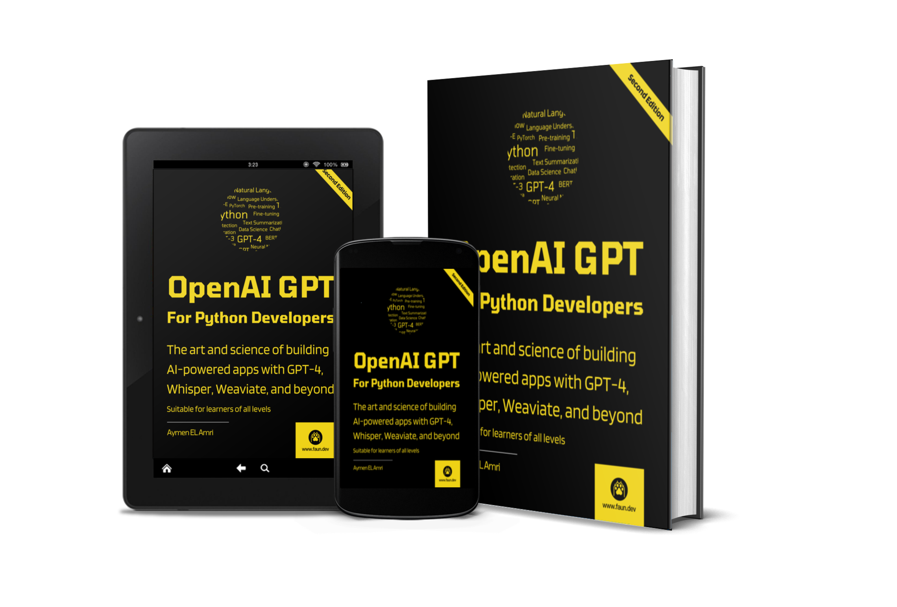

# OpenAI GPT For Python Developers

This repository contains the code and other resources used in [OpenAI GPT for Python Developers](https://amzn.to/3U99smX).

## About

The knowledge you'll acquire from this guide will be applicable to the current families of GPT models (GPT-3, GPT-3.5, GPT-4, etc.) and will likely also be relevant to GPT-5, should it ever be released.

OpenAI provides APIs (Application Programming Interfaces) to access their AI. The goal of an API is to abstract the underlying models by creating a universal interface for all versions, allowing users to use GPT regardless of its version.

This guide aims to provide a comprehensive, step-by-step tutorial on how to utilize GPT-3.5 and GPT-4 in your projects via this API. It also covers other models, such as Whisper and Text-to-Speech.

If you're developing a chatbot, an AI assistant, or a web application that utilizes AI-generated data, this guide will assist you in achieving your objectives.

If you have a basic understanding of the Python programming language and are willing to learn a few additional techniques, such as using Pandas Dataframes and some NLP methods, you possess all the necessary tools to start building intelligent systems with OpenAI tools.

Rest assured, **you don't need to be a data scientist, machine learning engineer, or AI expert** to comprehend and implement the concepts, techniques, and tutorials presented in this guide. The explanations provided are straightforward and easy to understand, featuring simple Python code, examples, and hands-on exercises.

This guide emphasizes practical, hands-on learning and is designed to assist readers in building real-world applications. It is example-driven and provides numerous practical examples to help readers understand the concepts and apply them to real-life scenarios to solve real-world problems.

By the end of your learning journey, you will have developed applications such as:

- Fine-tuned, domain-specific chatbots.
- An intelligent conversational system with memory and context.
- A semantic modern search engine using RAG and other techniques.
- An intelligent coffee recommendation system based on your taste.
- A chatbot assistant to assist with Linux commands
- A fine-tuned news category prediction system.
- An AI-to-AI autonomous discussion system to simulate human-like conversations or solve problems
- An AI-based mental health coach trained on a large dataset of mental health conversations
- and more!

By reading this guide and following the examples, you will be able to:

- Understand the different models available, and how and when to use each one.
- Generate human-like text for various purposes, such as answering questions, creating content, and other creative uses.
- Control the creativity of GPT models and adopt the best practices to generate high-quality text.
- Transform and edit the text to perform translation, formatting, and other useful tasks.
- Optimize the performance of GPT models using various parameters and options such as max_tokens, temperature, top_p, n, stream, logprobs, stop, presence_penalty, frequency_penalty, best_of, and others.
- Stem, lemmatize and reduce your costs when using the API.
- Understand Context Stuffing, chaining, and practice prompt engineering.
- Implement a chatbot with memory and context.
- Create prediction algorithms and zero-shot techniques and evaluate their accuracy.
- Understand, practice, and improve few-shot learning.
- Understand fine-tuning and leverage its power to create your own fine-tuned models.
- Understand and use fine-tuning best practices
- Practice training and classification techniques using GPT.
- Understand embedding and how companies such as Tesla and Notion are using it.
- Understand and implement semantic search, RAG, and other advanced tools and concepts.
- Integrate a Vector Database (e.g.: Weaviate) with your intelligent systems.- 